# 프로젝트 구조 시각화

## 1. 전체 시스템 아키텍처

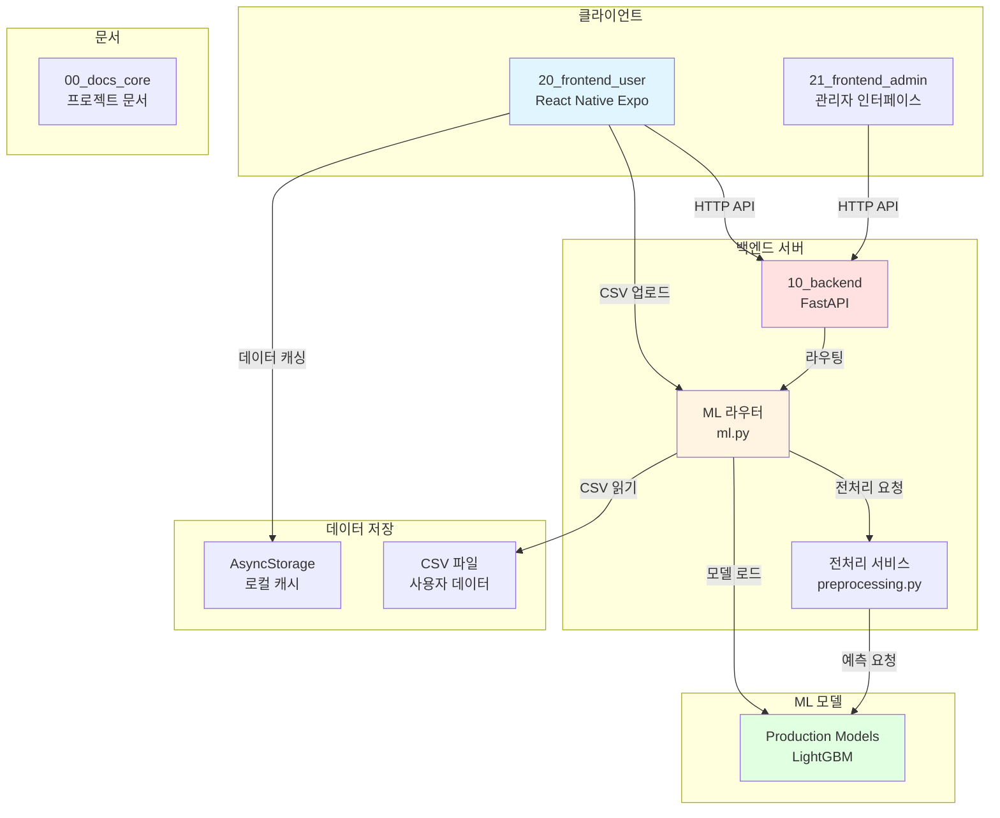

## 2. 프론트엔드 데이터 흐름

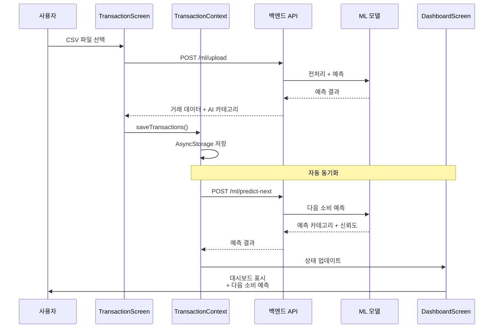

## 3. 디렉토리 구조 (계층형)

```mermaid
graph TD
    ROOT[/root/caffeine]
    
    ROOT --> DOC[00_docs_core/]
    ROOT --> BE[10_backend/]
    ROOT --> FE[20_frontend_user/]
    ROOT --> ARCH[archive/]
    ROOT --> MODEL[production_models/]
    ROOT --> SCRIPT[실행 스크립트]
    
    DOC --> DOC_D[design/]
    DOC --> DOC_M[manuals/]
    DOC --> DOC_F[PROJECT_HANDOFF.md<br/>프로젝트_전체_진행상황.md]
    
    DOC_D --> DOC_D_F[데이터베이스_테이블_스키마.md<br/>시스템구성도.txt<br/>쿼리문.txt]
    DOC_M --> DOC_M_F[작업+백엔드연동.md<br/>BACKEND_INTEGRATION_GUIDE.md]
    
    BE --> BE_APP[app/]
    BE --> BE_REQ[requirements.txt]
    
    BE_APP --> BE_MAIN[main.py]
    BE_APP --> BE_ROUTER[routers/]
    BE_APP --> BE_SERVICE[services/]
    BE_APP --> BE_MODEL[models/]
    
    BE_ROUTER --> BE_ML[ml.py<br/>407줄]
    BE_SERVICE --> BE_PREP[preprocessing.py<br/>433줄]
    
    FE --> FE_SRC[src/]
    FE --> FE_APP[App.js]
    FE --> FE_PKG[package.json]
    
    FE_SRC --> FE_CTX[contexts/]
    FE_SRC --> FE_SCR[screens/]
    FE_SRC --> FE_COMP[components/]
    
    FE_CTX --> FE_TC[TransactionContext.js<br/>110줄]
    FE_SCR --> FE_DASH[DashboardScreen.js<br/>808줄]
    FE_SCR --> FE_TRANS[TransactionScreen.js]
    FE_SCR --> FE_ML[MLTestScreen.js<br/>175줄]
    
    ARCH --> ARCH_F[1년치가계부.csv<br/>old_model.joblib 82MB<br/>metadata.json]
    MODEL --> MODEL_F[lightgbm_model.joblib<br/>25MB]
    SCRIPT --> SCRIPT_F[start_all.sh<br/>start_backend.sh<br/>start_frontend.sh<br/>stop_all.sh]
    
    style ROOT fill:#e1f5ff
    style BE fill:#ffe1e1
    style FE fill:#e1ffe1
    style DOC fill:#fff4e1
    style MODEL fill:#ffe1ff
```

## 4. ML API 엔드포인트 구조

```mermaid
graph LR
    subgraph "클라이언트 요청"
        A1[단일 거래 예측]
        A2[CSV 업로드]
        A3[다음 소비 예측]
    end
    
    subgraph "API 엔드포인트"
        B1[POST /ml/predict]
        B2[POST /ml/upload]
        B3[POST /ml/predict-next]
    end
    
    subgraph "처리 과정"
        C1[데이터 검증]
        C2[전처리]
        C3[모델 예측]
        C4[결과 변환]
    end
    
    subgraph "응답"
        D1[{prediction: 카테고리}]
        D2[{transactions: [...],<br/>summary: {...}}]
        D3[{predicted_category: 외식,<br/>confidence: 0.85,<br/>probabilities: {...}}]
    end
    
    A1 --> B1 --> C1 --> C2 --> C3 --> C4 --> D1
    A2 --> B2 --> C1 --> C2 --> C3 --> C4 --> D2
    A3 --> B3 --> C1 --> C2 --> C3 --> C4 --> D3
    
    style B1 fill:#e1f5ff
    style B2 fill:#e1ffe1
    style B3 fill:#fff4e1
```

## 5. 변경사항 요약 (파이 차트 개념)

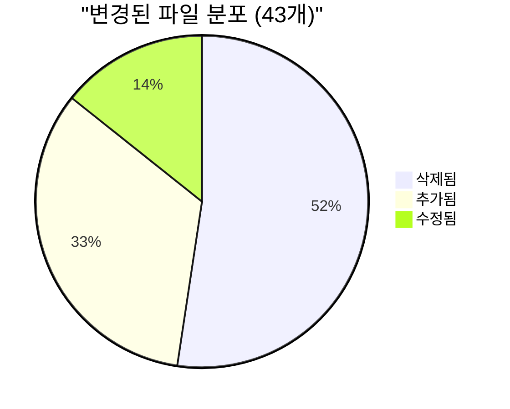

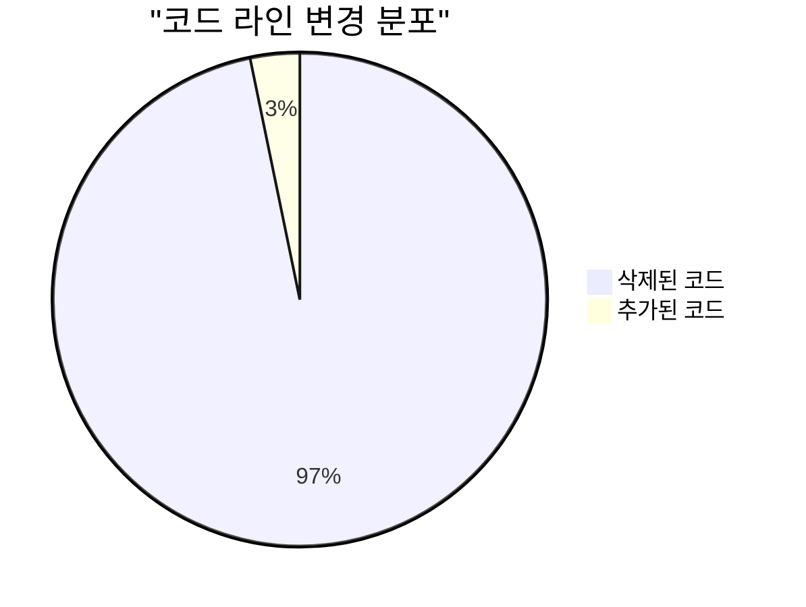

## 6. Git 변경사항 분석

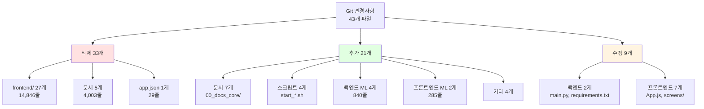

## 7. 백엔드 모듈 의존성

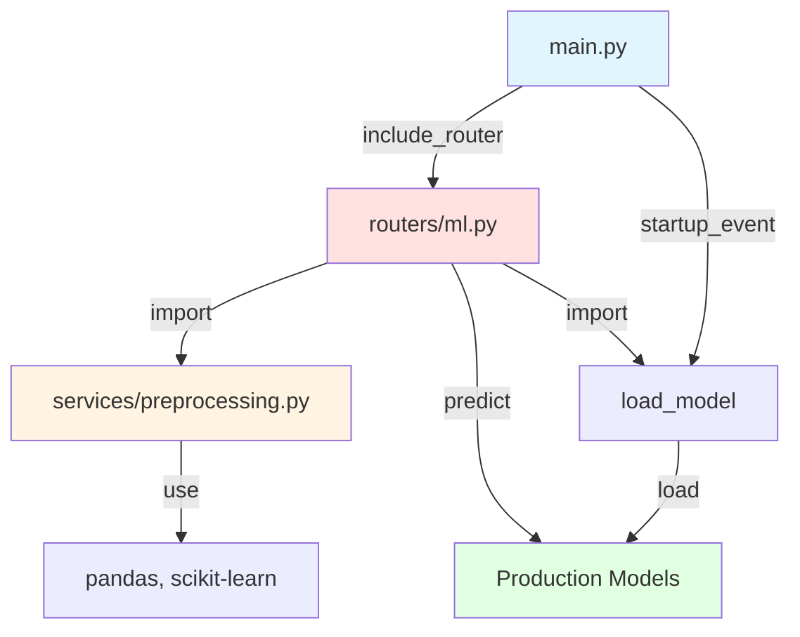

## 8. 프론트엔드 컴포넌트 관계

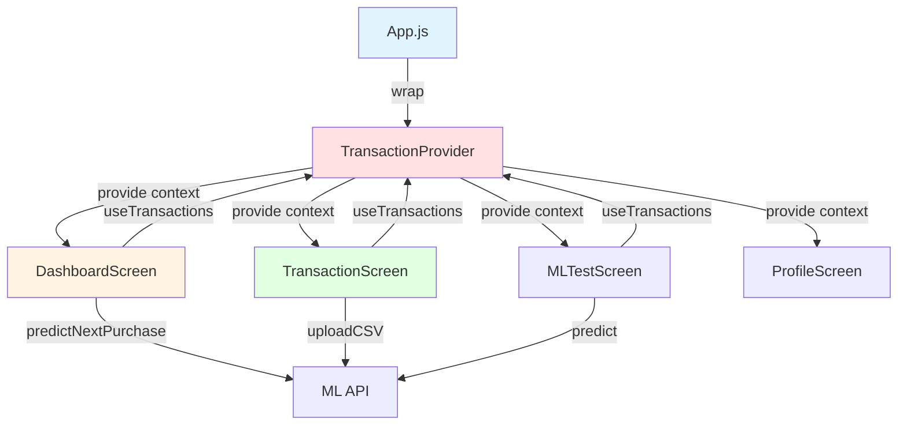

## 9. 데이터 동기화 흐름

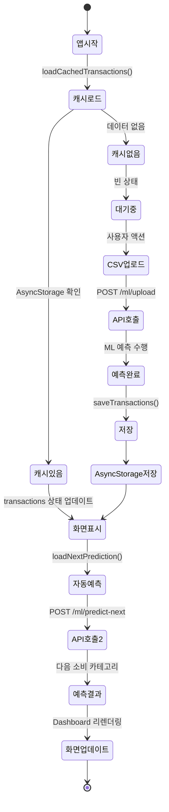

## 10. 실행 스크립트 흐름

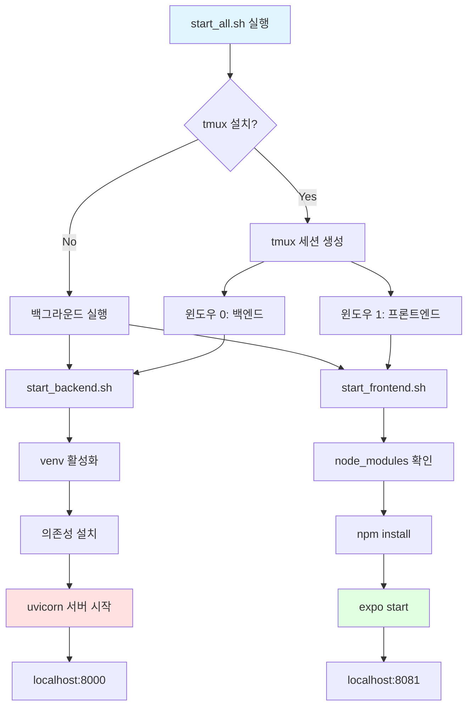

## 11. 파일 이동 맵

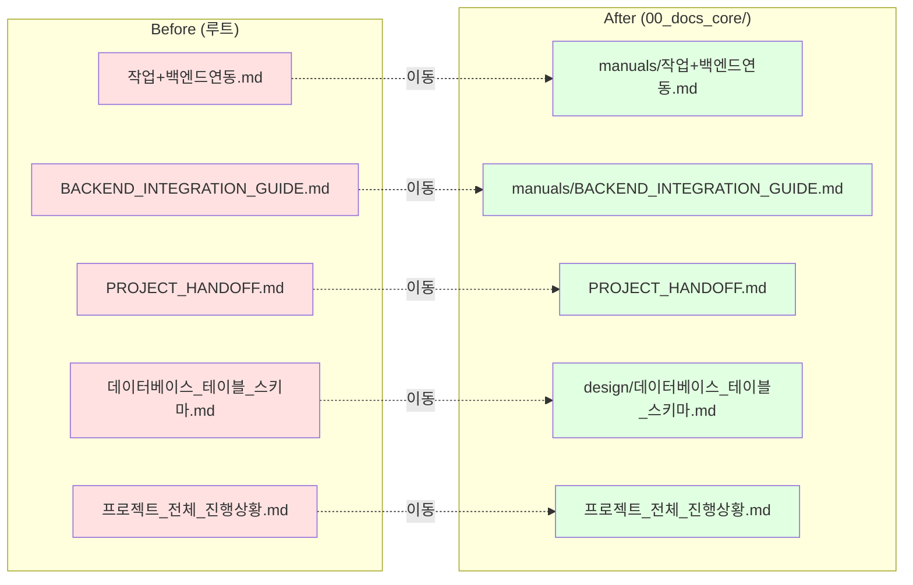

## 12. Context API 패턴

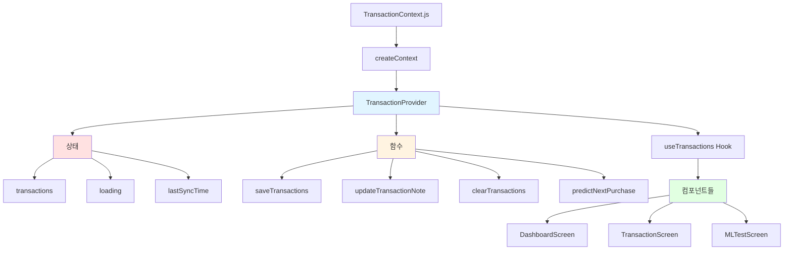

## 13. 루트 디렉토리 정리 Before/After

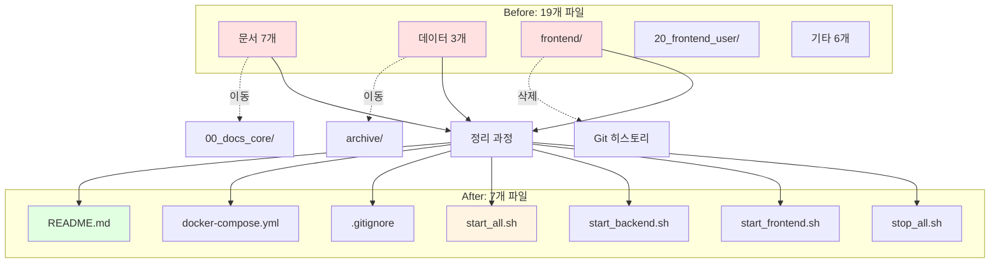

## 14. ML 예측 파이프라인

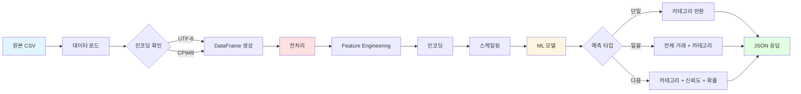

## 15. 변경사항 타임라인

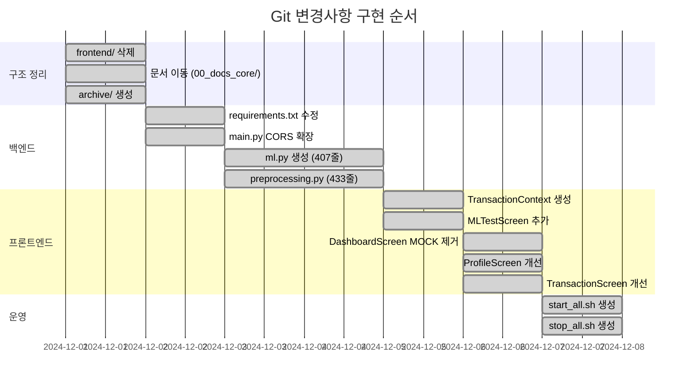

## 요약

총 15개의 시각화로 프로젝트 구조를 다각도로 표현했습니다:

1. **시스템 아키텍처**: 전체 시스템 구성요소 관계
2. **데이터 흐름**: 프론트엔드 → 백엔드 → ML 순서도
3. **디렉토리 구조**: 계층형 폴더 트리
4. **ML API**: 3개 엔드포인트 구조
5. **변경 분포**: 파일 및 코드라인 통계
6. **Git 분석**: 삭제/추가/수정 분류
7. **모듈 의존성**: 백엔드 컴포넌트 관계
8. **컴포넌트 관계**: 프론트엔드 구조
9. **동기화 흐름**: 상태 머신
10. **실행 흐름**: 스크립트 로직
11. **파일 이동**: Before/After 매핑
12. **Context 패턴**: React Context 구조
13. **루트 정리**: 파일 개수 변화
14. **ML 파이프라인**: 예측 프로세스
15. **타임라인**: 구현 순서
